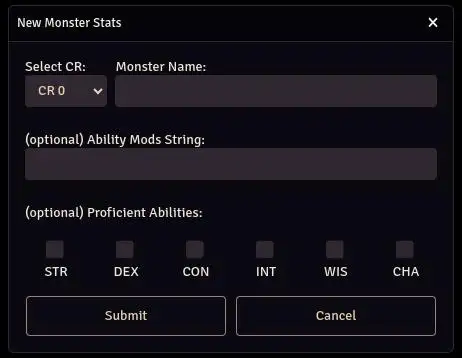

## Lazy GM's 5e Monster Builder
A module for the Foundry VTT Black Flag Roleplaying system.
Deploy a new monster in Foundry using stats from the [Lazy GM's 5e Monster Builder](https://slyflourish.com/lazy_5e_monster_building_resource_document.html).

## How to Use
When the module is active, you will see a button at the bottom of the actors tab labeled "Generate Monster"

Clicking the button will open a window to specify the desired monster's CR.

Optionally, you can specify the monster's name and choose the monster's proficient abilities.

When you click Submit a new actor will be created with the specified monster name (or 'New Monster' if not specified).

## Attribution

This work includes material taken from the [Lazy GM's 5e Monster Builder Resource Document](https://slyflourish.com/lazy_5e_monster_building_resource_document.html) written by Teos Abadía of [Alphastream.org](https://alphastream.org/), Scott Fitzgerald Gray of [Insaneangel.com](https://insaneangel.com/), and Michael E. Shea of [SlyFlourish.com](https://slyflourish.com/), available under a [Creative Commons Attribution 4.0 International License](http://creativecommons.org/licenses/by/4.0/).

This work includes material taken from the System Reference Document 5.1 ("SRD 5.1") by Wizards of the Coast LLC and available at https://dnd.wizards.com/resources/systems-reference-document. The SRD 5.1 is licensed under the Creative Commons Attribution 4.0 International License available at https://creativecommons.org/licenses/by/4.0/legalcode.

## Credit

Took several ideas from my favorite module [5e-statblock-importer](https://github.com/jbhaywood/5e-statblock-importer/tree/main).